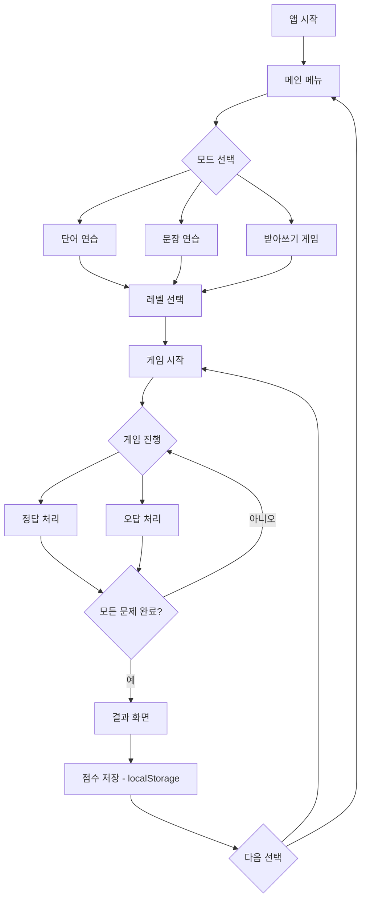
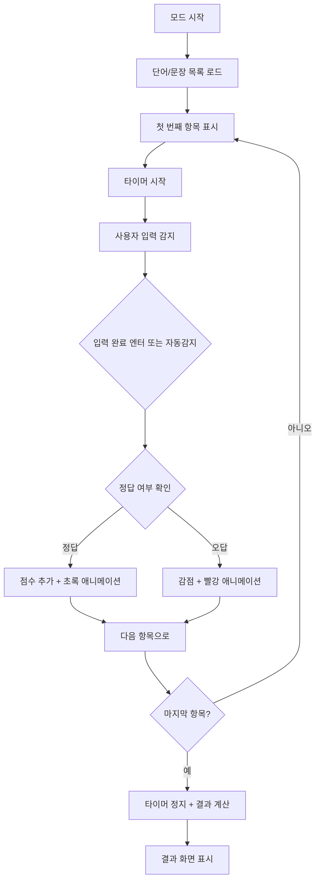
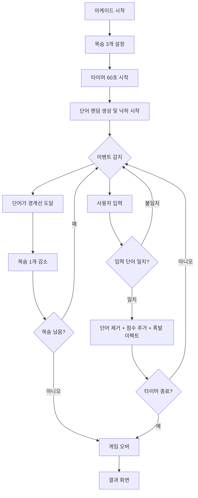

# 🎮 초등학생 한국어 타자 게임 - 설계 문서

> 버전: 1.0 | 작성일: 2026-03-16

---

## 1. 파일 구조

```
project/
├── index.html          # 메인 HTML (단일 진입점)
├── css/
│   ├── style.css       # 공통 스타일, 레이아웃
│   ├── theme.css       # 색상 테마, 캐릭터 스타일
│   └── animations.css  # 애니메이션 효과
├── js/
│   ├── main.js         # 앱 초기화, 화면 라우팅
│   ├── data.js         # 단어/문장 데이터 (레벨별)
│   ├── wordMode.js     # 단어 연습 모드 로직
│   ├── sentenceMode.js # 문장 연습 모드 로직
│   ├── arcadeMode.js   # 받아쓰기/아케이드 모드 로직
│   ├── score.js        # 점수/WPM 계산, localStorage 저장
│   └── ui.js           # 공통 UI 헬퍼 함수
└── assets/
    └── sounds/         # (선택) 효과음 파일
        ├── correct.mp3
        ├── wrong.mp3
        └── levelup.mp3
```

---

## 2. 화면 구성 및 UI/UX 설계

### 2.1 화면 목록 (SPA 방식 - 화면 전환)

| 화면 ID | 이름 | 설명 |
|---|---|---|
| `#screen-main` | 메인 메뉴 | 게임 모드 선택 |
| `#screen-level` | 레벨 선택 | 학년 단계 선택 |
| `#screen-word` | 단어 연습 | 단어 타이핑 |
| `#screen-sentence` | 문장 연습 | 문장 타이핑 |
| `#screen-arcade` | 받아쓰기 게임 | 아케이드 스타일 |
| `#screen-result` | 결과 화면 | 통계 및 점수 |

---

### 2.2 메인 메뉴 화면 (`#screen-main`)

```
┌──────────────────────────────────────────┐
│  🌟 한글 타자왕 🌟                         │
│  (귀여운 캐릭터 애니메이션)                  │
│                                          │
│  ┌──────────┐  ┌──────────┐             │
│  │ ✏️ 단어   │  │ 📖 문장  │             │
│  │  연습    │  │  연습    │             │
│  └──────────┘  └──────────┘             │
│                                          │
│  ┌──────────────────────┐               │
│  │ 🎮 받아쓰기 게임     │               │
│  └──────────────────────┘               │
│                                          │
│  🏆 최고점수: 1,250점    ⚙️ 설정         │
└──────────────────────────────────────────┘
```

- 배경: 하늘색 그라데이션 + 구름 애니메이션
- 버튼: 크고 둥근 형태, 호버 시 흔들림 애니메이션
- 마스코트 캐릭터 (CSS로 구현한 귀여운 캐릭터)

---

### 2.3 레벨 선택 화면 (`#screen-level`)

```
┌──────────────────────────────────────────┐
│  < 뒤로가기                               │
│                                          │
│  ⭐ 단계를 선택하세요!                    │
│                                          │
│  ┌────────┐  ┌────────┐  ┌────────┐    │
│  │  🐣   │  │  🐥   │  │  🐓   │    │
│  │ 쉬움  │  │ 보통  │  │ 어려움 │    │
│  │1~2학년│  │3~4학년│  │5~6학년 │    │
│  └────────┘  └────────┘  └────────┘    │
└──────────────────────────────────────────┘
```

- 각 레벨 카드는 새/동물 이모지로 표현
- 잠금 기능 없음 (자유롭게 선택 가능)

---

### 2.4 단어 연습 화면 (`#screen-word`)

```
┌──────────────────────────────────────────┐
│  ⏱️ 02:30   🏆 점수: 250   정확도: 95%   │
├──────────────────────────────────────────┤
│                                          │
│  진행: ████████░░  8/10                  │
│                                          │
│  ┌──────────────────────────────────┐   │
│  │         🍎  사 과                 │   │  ← 목표 단어 (크게)
│  └──────────────────────────────────┘   │
│                                          │
│  ┌──────────────────────────────────┐   │
│  │  사과_                           │   │  ← 입력창
│  └──────────────────────────────────┘   │
│                                          │
│  ✅ 맞았어요! (초록 애니메이션)            │
│  ❌ 틀렸어요! (빨강 흔들림)               │
└──────────────────────────────────────────┘
```

- 단어 당 이모지/그림 힌트 표시
- 입력 중 글자 색상 실시간 변경 (맞음=초록, 틀림=빨강)
- 정답 시 폭죽 파티클 애니메이션

---

### 2.5 문장 연습 화면 (`#screen-sentence`)

```
┌──────────────────────────────────────────┐
│  ⏱️ 03:00   🏆 점수: 180   WPM: 45      │
├──────────────────────────────────────────┤
│                                          │
│  진행: ████░░░░░░  2/5                   │
│                                          │
│  ┌──────────────────────────────────┐   │
│  │  나는 학교에 가고 싶습니다.        │   │  ← 목표 문장
│  └──────────────────────────────────┘   │
│                                          │
│  ┌──────────────────────────────────┐   │
│  │  나는 학교에_                    │   │  ← 입력창
│  └──────────────────────────────────┘   │
│                                          │
│  글자별 색상 피드백:                       │
│  [나][는][ ][학][교] ... (초록/빨강)       │
└──────────────────────────────────────────┘
```

- 문장의 각 글자를 스팬으로 분리하여 실시간 색상 피드백
- 커서 위치 표시 (깜빡이는 효과)

---

### 2.6 받아쓰기 아케이드 화면 (`#screen-arcade`)

```
┌──────────────────────────────────────────┐
│  ❤️❤️❤️  남은 목숨     🏆 300점         │
│  ⏱️ 남은 시간: 60초                      │
├──────────────────────────────────────────┤
│                                          │
│  🍦                🎈         🚀         │  ← 단어들이
│  아이스크림       풍선        우주선       │     하늘에서 떨어짐
│                                          │
│                  🐸                      │
│                                          │
│  ████████████████████████████████████   │  ← 땅(경계선)
│                                          │
│  ┌──────────────────────────────────┐   │
│  │  아이스크림_                     │   │  ← 입력창
│  └──────────────────────────────────┘   │
│                 [Enter로 제출]            │
└──────────────────────────────────────────┘
```

- 단어들이 위에서 아래로 천천히 낙하
- 정답 입력 시 해당 단어 폭발 이펙트
- 땅에 닿으면 목숨 1개 감소
- 목숨 0개 = 게임 오버

---

### 2.7 결과 화면 (`#screen-result`)

```
┌──────────────────────────────────────────┐
│  🎉 수고했어요! 🎉                         │
│  (별점 표시: ⭐⭐⭐)                       │
│                                          │
│  ┌──────────────────────────────────┐   │
│  │  📊 이번 결과                    │   │
│  │  • 총 점수:    1,250점           │   │
│  │  • WPM:        45               │   │
│  │  • 정확도:     95%              │   │
│  │  • 맞은 단어:  18개             │   │
│  │  • 틀린 단어:  2개              │   │
│  └──────────────────────────────────┘   │
│                                          │
│  🏆 최고 기록 경신! (새 기록이면 표시)     │
│                                          │
│  [다시 도전] [메뉴로] [다음 레벨]          │
└──────────────────────────────────────────┘
```

---

## 3. 게임 로직 흐름도

### 3.1 전체 앱 흐름



### 3.2 단어/문장 연습 모드 흐름



### 3.3 아케이드 모드 흐름



---

## 4. 데이터 구조

### 4.1 단어/문장 데이터 (`data.js`)

```javascript
const GAME_DATA = {
  levels: {
    easy: {  // 1~2학년
      name: "쉬움 (1~2학년)",
      emoji: "🐣",
      words: [
        { text: "사과", emoji: "🍎", category: "과일" },
        { text: "바나나", emoji: "🍌", category: "과일" },
        { text: "학교", emoji: "🏫", category: "장소" },
        { text: "나비", emoji: "🦋", category: "동물" },
        // ... 50개 이상
      ],
      sentences: [
        "나는 밥을 먹었어요.",
        "오늘은 날씨가 맑아요.",
        // ... 20개 이상
      ]
    },
    normal: {  // 3~4학년
      name: "보통 (3~4학년)",
      emoji: "🐥",
      words: [ /* ... */ ],
      sentences: [ /* ... */ ]
    },
    hard: {    // 5~6학년
      name: "어려움 (5~6학년)",
      emoji: "🐓",
      words: [ /* ... */ ],
      sentences: [ /* ... */ ]
    }
  }
};
```

### 4.2 게임 상태 객체 (`GameState`)

```javascript
const GameState = {
  currentMode: null,       // 'word' | 'sentence' | 'arcade'
  currentLevel: null,      // 'easy' | 'normal' | 'hard'
  currentIndex: 0,         // 현재 문제 인덱스
  totalItems: 0,           // 전체 문제 수
  correctCount: 0,         // 맞은 수
  wrongCount: 0,           // 틀린 수
  score: 0,                // 현재 점수
  startTime: null,         // 게임 시작 시각 (Date)
  timerInterval: null,     // 타이머 인터벌 ID
  timeLimit: 60,           // 제한 시간 (초)
  lives: 3,                // 아케이드 목숨 수
  fallingWords: [],        // 아케이드 낙하 단어 배열
};
```

### 4.3 낙하 단어 객체 (아케이드 모드)

```javascript
const FallingWord = {
  id: String,              // 고유 ID
  text: String,            // 단어 텍스트
  x: Number,               // 화면 X 위치 (%)
  y: Number,               // 현재 Y 위치 (px)
  speed: Number,           // 낙하 속도 (px/frame)
  element: HTMLElement,    // DOM 요소 참조
};
```

### 4.4 점수 저장 구조 (`localStorage`)

```javascript
// localStorage key: 'koreanTypingGame'
const SaveData = {
  highScores: {
    word: {
      easy:   { score: 0, wpm: 0, accuracy: 0, date: "" },
      normal: { score: 0, wpm: 0, accuracy: 0, date: "" },
      hard:   { score: 0, wpm: 0, accuracy: 0, date: "" },
    },
    sentence: { /* 동일 구조 */ },
    arcade:   { /* 동일 구조 */ },
  },
  totalGamesPlayed: 0,
  totalCorrect: 0,
};
```

### 4.5 점수 계산 공식

```
WPM = (입력한 글자 수 / 5) / (경과 시간(분))

정확도(%) = (맞은 단어 수 / 전체 단어 수) × 100

기본 점수(단어) = 100점
보너스(연속 정답) = 연속 수 × 10점
시간 보너스 = max(0, (제한시간 - 경과시간) × 2)점
오답 패널티 = -20점
```

---

## 5. CSS 테마 계획

### 5.1 색상 팔레트

| 용도 | 색상 이름 | HEX 값 |
|---|---|---|
| 주 배경 | 하늘 파랑 | `#87CEEB` |
| 보조 배경 | 연한 노랑 | `#FFFDE7` |
| 주 버튼 | 산호 주황 | `#FF7043` |
| 보조 버튼 | 초록 | `#66BB6A` |
| 정답 색상 | 초록 | `#4CAF50` |
| 오답 색상 | 빨강 | `#F44336` |
| 텍스트(진) | 진남색 | `#1A237E` |
| 텍스트(연) | 회색 | `#757575` |
| 카드 배경 | 흰색 | `#FFFFFF` |
| 강조 | 황금색 | `#FFD700` |

### 5.2 폰트 계획

```css
/* 구글 폰트 (한국어 지원) */
@import url('https://fonts.googleapis.com/css2?family=Nanum+Pen+Script&family=Noto+Sans+KR:wght@400;700;900&display=swap');

:root {
  --font-title: 'Nanum Pen Script', cursive;  /* 제목용 */
  --font-body: 'Noto Sans KR', sans-serif;    /* 본문용 */
  --font-size-xl: clamp(2rem, 5vw, 4rem);
  --font-size-lg: clamp(1.5rem, 3vw, 2.5rem);
  --font-size-md: clamp(1rem, 2vw, 1.5rem);
  --font-size-sm: clamp(0.8rem, 1.5vw, 1rem);
}
```

### 5.3 주요 UI 컴포넌트 스타일

```css
/* 버튼 공통 스타일 */
.btn {
  border-radius: 50px;          /* 완전한 둥근 버튼 */
  padding: 16px 32px;
  font-size: var(--font-size-md);
  font-weight: 900;
  box-shadow: 0 6px 0 rgba(0,0,0,0.2);  /* 3D 효과 */
  transition: transform 0.1s, box-shadow 0.1s;
  cursor: pointer;
  border: none;
}
.btn:active {
  transform: translateY(4px);
  box-shadow: 0 2px 0 rgba(0,0,0,0.2);
}
.btn:hover {
  animation: wiggle 0.3s ease;
}

/* 입력창 */
.input-field {
  border: 4px solid #90CAF9;
  border-radius: 16px;
  font-size: var(--font-size-lg);
  padding: 12px 20px;
  text-align: center;
  background: #F8F9FA;
  width: 100%;
  transition: border-color 0.2s;
}
.input-field:focus { border-color: #1976D2; }
.input-field.correct { border-color: #4CAF50; background: #E8F5E9; }
.input-field.wrong   { border-color: #F44336; background: #FFEBEE; }

/* 단어 카드 */
.word-card {
  background: white;
  border-radius: 24px;
  padding: 40px;
  box-shadow: 0 8px 24px rgba(0,0,0,0.1);
  text-align: center;
  font-size: var(--font-size-xl);
  font-weight: 900;
  color: var(--color-text-dark);
}
```

### 5.4 애니메이션 목록 (`animations.css`)

| 애니메이션 이름 | 용도 | 설명 |
|---|---|---|
| `wiggle` | 버튼 호버 | 좌우 흔들림 |
| `bounce-in` | 단어 등장 | 튀어오르는 효과 |
| `shake` | 오답 피드백 | 입력창 흔들림 |
| `pop` | 정답 피드백 | 커졌다 작아짐 |
| `float` | 배경 구름 | 천천히 이동 |
| `fall` | 아케이드 단어 | 위에서 아래로 |
| `explode` | 아케이드 정답 | 폭발 파티클 |
| `star-burst` | 결과 화면 | 별 터지기 |
| `slide-in` | 화면 전환 | 슬라이드 인 |

---

## 6. JavaScript 주요 함수/모듈 목록

### 6.1 `main.js` - 앱 초기화 및 라우팅

```javascript
// 화면 전환 관리
function showScreen(screenId)          // 특정 화면 표시, 나머지 숨김
function navigateTo(screenId, params)  // 화면 이동 + 파라미터 전달
function initApp()                     // 앱 초기화, 이벤트 리스너 등록

// 이벤트 핸들러
function onModeSelect(mode)            // 모드 버튼 클릭
function onLevelSelect(level)          // 레벨 선택
function onBackButton()                // 뒤로가기
```

### 6.2 `wordMode.js` - 단어 연습 모드

```javascript
function startWordMode(level)          // 단어 모드 시작, 단어 목록 로드
function loadNextWord()                // 다음 단어 표시
function displayWord(wordObj)          // 단어 + 이모지 렌더링
function checkWordInput(input)         // 입력값과 정답 비교
function onWordCorrect()               // 정답 처리 (점수, 애니메이션)
function onWordWrong()                 // 오답 처리
function endWordMode()                 // 모드 종료 + 결과 계산
function shuffleWords(words)           // 단어 목록 랜덤 섞기
```

### 6.3 `sentenceMode.js` - 문장 연습 모드

```javascript
function startSentenceMode(level)      // 문장 모드 시작
function loadNextSentence()            // 다음 문장 표시
function renderSentenceChars(sentence) // 문장을 글자별 span으로 분리 렌더링
function updateCharFeedback(input)     // 실시간 글자별 색상 피드백
function checkSentenceComplete(input)  // 문장 완성 여부 확인
function calculateWPM(chars, seconds)  // WPM 계산
function endSentenceMode()             // 종료 처리
```

### 6.4 `arcadeMode.js` - 아케이드 모드

```javascript
function startArcadeMode(level)        // 아케이드 시작, 초기화
function spawnFallingWord()            // 새 단어 생성 (랜덤 위치/속도)
function updateFallingWords(delta)     // 매 프레임 단어 위치 업데이트
function checkWordMatch(input)         // 입력값과 낙하 단어 매칭
function removeWord(wordId, success)   // 단어 제거 (정답/실패)
function onWordMissed(wordObj)         // 단어 놓침 처리 (목숨 감소)
function triggerExplosion(x, y)        // 폭발 이펙트 렌더링
function gameLoop(timestamp)           // requestAnimationFrame 루프
function endArcadeMode()               // 게임 종료
function updateLives(lives)            // 목숨 UI 업데이트
```

### 6.5 `score.js` - 점수 관리

```javascript
function calculateScore(correct, wrong, time, combo) // 최종 점수 계산
function calculateAccuracy(correct, total)           // 정확도(%) 계산
function calculateWPM(charCount, seconds)            // WPM 계산
function saveHighScore(mode, level, scoreData)       // localStorage 저장
function loadHighScore(mode, level)                  // 최고 점수 로드
function isNewRecord(mode, level, score)             // 신기록 여부 확인
function getAllHighScores()                           // 전체 점수 로드
function resetAllScores()                            // 점수 초기화
```

### 6.6 `ui.js` - 공통 UI 유틸리티

```javascript
function showResult(stats)             // 결과 화면 데이터 렌더링
function updateProgressBar(current, total) // 진행 바 업데이트
function updateTimer(seconds)          // 타이머 표시 업데이트
function updateScore(score)            // 점수 표시 업데이트
function showFeedback(type, message)   // 정답/오답 피드백 메시지
function triggerConfetti()             // 축하 파티클 이펙트
function playSound(soundName)          // 효과음 재생 (있을 경우)
function showStarRating(score, max)    // 별점 계산 및 표시
function createComboDisplay(combo)     // 연속 정답 콤보 표시
```

---

## 7. 주요 구현 기술 상세

### 7.1 한국어 입력 처리 방식

```javascript
// 한국어는 input 이벤트로 실시간 감지
inputEl.addEventListener('input', (e) => {
  // compositionend 이벤트로 조합 완료 감지
  updateCharFeedback(e.target.value);
});

inputEl.addEventListener('compositionend', (e) => {
  // 자모 조합 완료 시점에 정확한 비교
  checkInput(e.target.value);
});

inputEl.addEventListener('keydown', (e) => {
  if (e.key === 'Enter') {
    submitAnswer(e.target.value);
    e.target.value = '';
  }
});
```

### 7.2 아케이드 모드 렌더링 (CSS + JS)

- `requestAnimationFrame`으로 60fps 게임 루프 구현
- 낙하 단어는 `position: absolute`로 배치
- `transform: translateY()`로 부드러운 이동
- 단어 속도는 레벨과 경과 시간에 따라 점진적 증가

### 7.3 화면 전환 (SPA)

- 모든 화면은 HTML에 미리 정의, `display: none/block`으로 전환
- CSS `transition`으로 슬라이드/페이드 효과 추가
- `history.pushState`는 사용하지 않음 (단순성 유지)

### 7.4 반응형 레이아웃

- 태블릿/PC 환경 우선 (초등학교 교실 환경 고려)
- CSS Grid/Flexbox 사용
- `clamp()`으로 폰트 크기 자동 조절
- 최소 지원 해상도: 768px × 600px

---

## 8. 단계별 구현 순서 (권장)

1. `index.html` 기본 구조 및 모든 화면 뼈대 작성
2. `style.css` + `theme.css` 기본 스타일링
3. `data.js` 단어/문장 데이터 입력
4. `main.js` 화면 라우팅 구현
5. `score.js` 점수/저장 로직 구현
6. `ui.js` 공통 UI 헬퍼 구현
7. `wordMode.js` 단어 연습 모드 구현
8. `sentenceMode.js` 문장 연습 모드 구현
9. `arcadeMode.js` 아케이드 모드 구현
10. `animations.css` 애니메이션 추가
11. 전체 테스트 및 디버깅

---

*설계 문서 끝 - 이 문서를 기반으로 코드 모드에서 구현을 진행하세요.*
